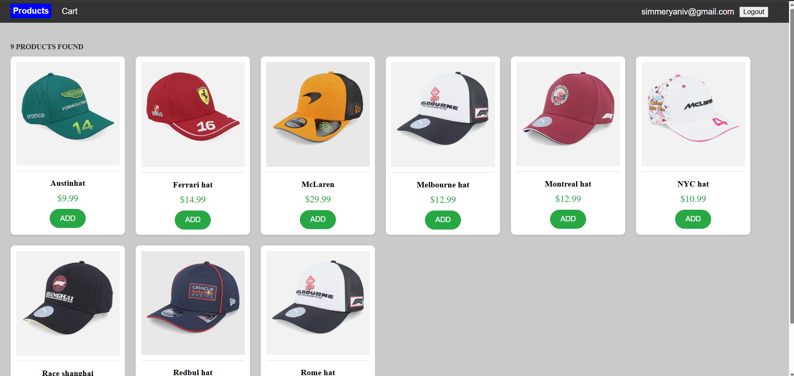

# Shopping Cart Application

This project is a shopping cart application built with Angular and Node.js. It demonstrates a full-stack web application with a focus on web development practices.

### Webpage Screenshot

### About the Project

This project includes a frontend built with Angular and a backend built with Node.js. The frontend allows users to browse products, add them to a shopping cart, and proceed to checkout. The backend handles user authentication, product management, and order processing. The application uses a CSV file to store product data and serves it through a REST API.